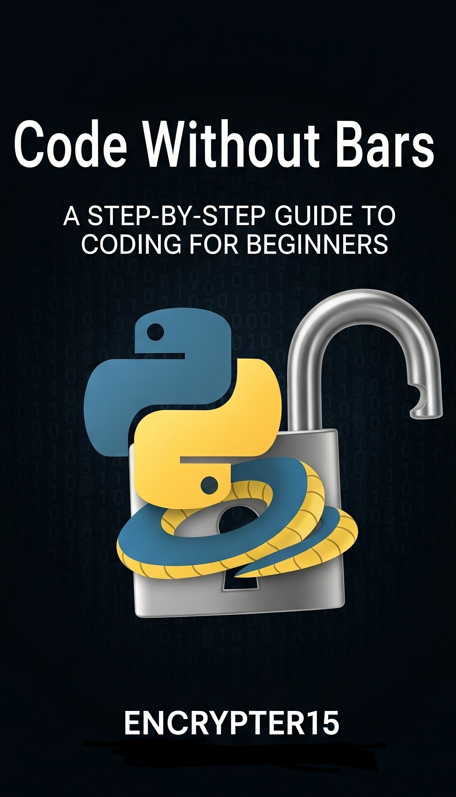

# Code Without Bars: Python Adventures



**Code Without Bars: Python Adventures** is an empowering, beginner-friendly guide to learning Python programming, designed for learners in any environment, including those without computer access. Tailored for individuals seeking to break cycles of recidivism through coding, this book provides a paper-based approach to mastering Python fundamentals. Inspired by programs like The Last Mile, which achieve near-zero recidivism rates through tech education, this book equips you with skills for a tech career and a transformative future. As Edmund Hillary and Roger Bannister showed, *“what one man can do, another can do”*—this book helps you prove it!

## About the Book

This book introduces Python programming through hands-on, paper-based exercises, making it accessible to learners in incarceration or other low-resource settings. It covers:

- **Basics**: Variables, data types, and input/output.
- **Control Flow**: Conditionals (`if` statements) and loops (`for`, `while`).
- **Data Structures**: Lists, dictionaries, and strings.
- **Functions**: Defining and using reusable code.
- **Projects**: Simple trackers and quizzes to apply your skills.

Each chapter includes:
- Clear explanations of Python concepts.
- Paper-based coding exercises to simulate programs mentally.
- Reflection prompts to connect coding to personal growth.
- Inspirational stories tying coding to breaking cycles.

## Who This Book Is For

- Beginners new to programming, especially in constrained environments.
- Individuals seeking tech skills to reduce recidivism and build stable careers.
- Educators and mentors teaching coding in non-traditional settings.
- Anyone inspired to transform their future through coding, like the “change gang” mindset.

## Getting Started

Since this book is designed for paper-based learning, no computer is required! To use this repository:

1. **Read the Book**: Follow the chapters in *Code Without Bars: Python Adventures* (available in print or PDF).
2. **Practice Exercises**: Complete the paper-based coding exercises, writing Python code by hand and simulating outputs mentally.
3. **Explore Code Examples**: This repository contains sample Python files for each chapter’s exercises (e.g., `chapter1_variables.py`, `chapter2_loops.py`), which you can review when you have computer access.
4. **Reflect and Plan**: Use the reflection prompts to connect coding to your goals, like job readiness or inspiring your community.

To simulate a chapter exercise on paper:
- Write the code from an exercise (e.g., a loop to print numbers).
- Trace the logic step-by-step to predict the output.
- Check your work against the book’s solutions or this repository’s examples.

## Repository Structure

- `/chapters`: Python files for each chapter’s exercises (e.g., `chapter3_lists.py`).
- `/solutions`: Sample solutions for paper-based exercises.
- `/resources`: Additional guides for paper-based coding and career planning.
- `cover_image_beginner.jpg`: Book cover image (placeholder).

## Example Exercise (Chapter 2: Loops)
```python
# Print numbers 1 to 5
for i in range(1, 6):
    print(i)
```
**Paper-Based Task**: Write this code on paper, trace each iteration, and predict the output (1, 2, 3, 4, 5). Check your work mentally or with the book’s solution.

## Why Learn Python?

- **Accessibility**: Python’s simple syntax is beginner-friendly.
- **Career Opportunities**: Python is used in web development, data analysis, and automation—fields with high-demand jobs.
- **Transformation**: Coding skills reduce recidivism (e.g., The Last Mile’s 0-5% reoffending rate) and empower you to inspire others.
- **Empowerment**: Build tools like trackers or quizzes to plan your future, mirroring your journey from “chain gang” to “change gang.”

## Contributing

We welcome contributions to improve exercises, add solutions, or share stories of how coding has transformed lives. To contribute:
1. Fork this repository.
2. Add or edit files in `/chapters` or `/resources`.
3. Submit a pull request with a clear description.

Please follow our [Code of Conduct](CODE_OF_CONDUCT.md) to ensure an inclusive community.

## License

This project is licensed under the MIT License. See [LICENSE](LICENSE) for details.

## Acknowledgments

- Inspired by The Last Mile and other programs empowering coders in incarceration.
- Dedicated to learners breaking barriers and building futures.
- Thanks to the Python community for making coding accessible to all.

**Contact**: For questions or feedback, email [Encrypter15@gmail.com](mailto:Encrypter15@gmail.com).

**Keep coding, keep transforming, and show the world that “what one man can do, another can do!”**
```
